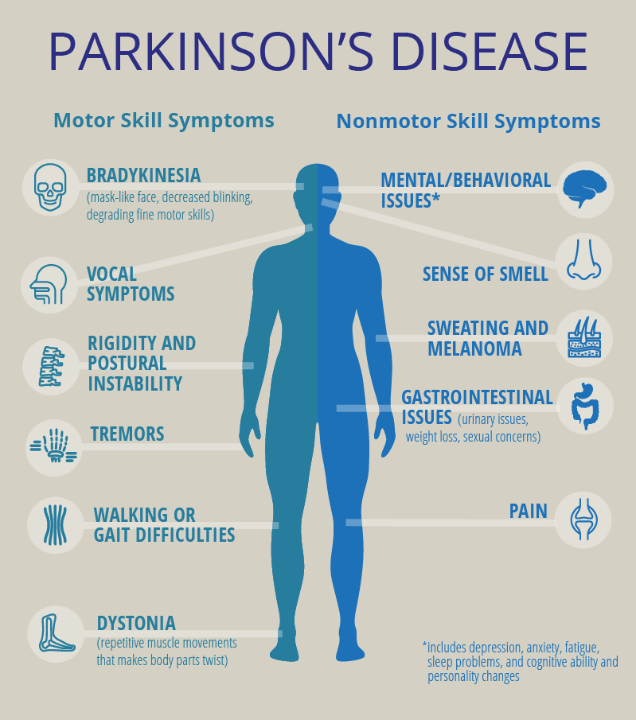

# Parkinson Disease Detection
Parkinson's disease is a progressive nervous system disorder that affects movement. Symptoms start gradually, sometimes starting with a barely noticeable tremor in just one hand. Tremors are common, but the disorder also commonly causes stiffness or slowing of movement.

<h2>Model Training</h2>
  Model is trained using both <b>Random Forest</b> and <b>XGBoost</b>.
  
  <h2>Conclusion</h2>
  
  <h4>Random Forest</h4>
  
  Accuracy = 0.90
  
  Recall = 0.97
  
  Precision = 0.90
  
  <h4>XGBoost</h4>
  
  Accuracy = 0.90
  
  Recall = 0.95
  
  Precision = 0.97 
